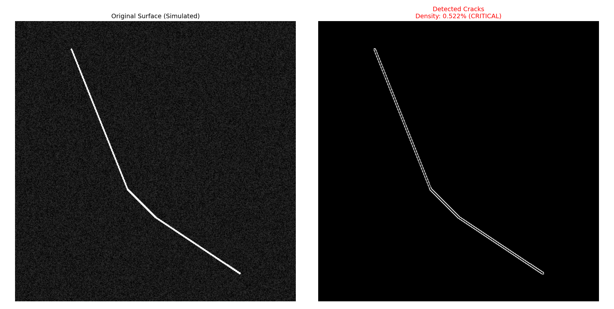

# 📡 Integrated Structural Health Monitoring (IoT & Vision)

### 🎯 Overview
A dual-modal system designed for automated infrastructure inspection. It combines **Computer Vision** (for surface crack detection using drones/cameras) and **IoT Signal Processing** (for internal damage detection using vibration sensors).

---

### 👁️ Part A: Computer Vision (Surface Crack Detection)
**Technique:** Using OpenCV to process imagery, applying Gaussian blurring for noise reduction, and Canny Edge Detection to isolate and quantify structural cracks.

*(Fig 1: Left: Simulated concrete surface with a crack. Right: The algorithm successfully isolates the crack and calculates its density.)*

---

### 📈 Part B: IoT Vibration Analysis (Internal Damage)
**Technique:** Ingesting high-frequency acceleration data from sensors. Using **Fast Fourier Transform (FFT)** to extract natural frequencies and an **Isolation Forest (AI)** model to detect stiffness drops instantaneously.

*(Fig 2: Real-time monitoring dashboard. The AI (Red Dots) instantly flags the structural damage that occurred at Day 150, indicated by the drop in natural frequency.)*

---

### 🛠️ Tech Stack
* **Vision:** Python, OpenCV, NumPy
* **IoT Signal Processing:** SciPy (FFT), Pandas
* **Machine Learning:** Scikit-Learn (Isolation Forest)
* **Visualization:** Matplotlib, Seaborn

> ⚠️ **Note:** Source code is available upon request for demonstration purposes.
