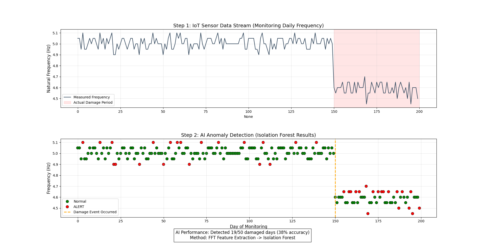

# 📡 Integrated Structural Health Monitoring (IoT & Vision)

### 🎯 Overview
A dual-modal system for real-time infrastructure monitoring. It combines **Signal Processing** (for vibration data) and **Computer Vision** (for surface inspection) to detect structural anomalies automatically.

### ⚙️ Modules
1.  **Vibration Analysis (IoT):**
    * Ingests high-frequency acceleration data.
    * Applies **Fast Fourier Transform (FFT)** to extract natural frequencies.
    * Uses **Isolation Forest (Unsupervised Learning)** to detect stiffness degradation (damage) in real-time.
2.  **Surface Inspection (Vision):**
    * Uses OpenCV to process drone imagery.
    * Applies Canny Edge Detection and noise filtering to identify and quantify concrete cracks.

### 📊 Dashboard

*(Fig 1: The AI successfully flags the "Regime Shift" (Red Dots) immediately after the simulated structural damage occurs at Day 150.)*

### 🛠️ Tech Stack
* **Signal Processing:** SciPy (FFT), Scikit-Learn (Isolation Forest)
* **Computer Vision:** OpenCV
* **Visualization:** Matplotlib

---
> ⚠️ **Note:** Source code is available upon request.
